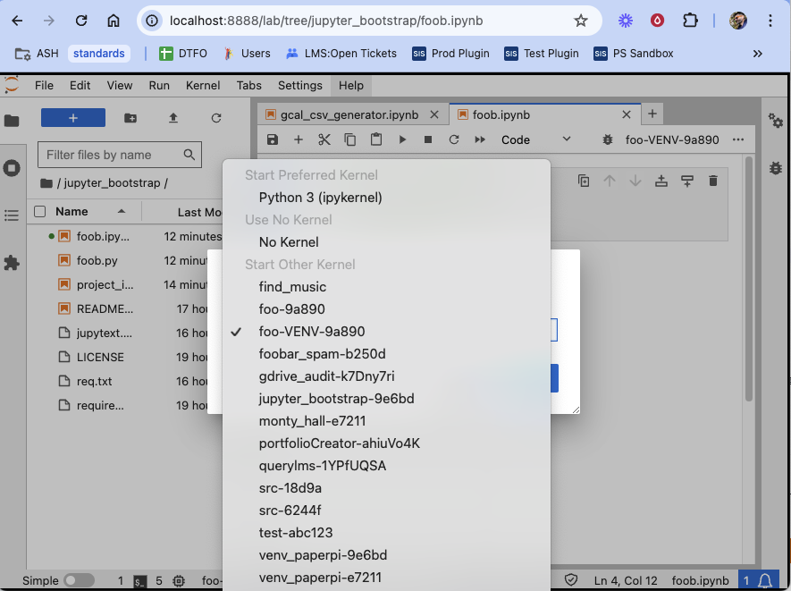

# pyenv_utilities
Python virtual environment utilities for bootstrapping a virtual environment. `init_environment.sh` will create a new virtual environment by default. Optionally, create a pyenv environment using a specific python version.

This script makes it easy to manage per-project virtual environments and offers the possibility of installing Jupyter kernelspecs for each project. This makes it trivial to use different kernels for individual projects.

## General Usage

```
  Setup a virtual environment for this project

  Usage:
    $0 [option]

  Options:
    -c                Create the virtual environment (using venv by default)
    -j                Create the virtual environment AND add Jupyter kernel for development
    --pyenv <version> Create the virtual environment using pyenv with specified Python version 
                      -c or -j is required
    -p                Purge the virtual environment and clean Jupyter kernelspecs
    -k                Purge jupyter kernelspecs for this project
    -h                Display this help screen
```

### Quick Start

These options will clone pyenv_utilities into `./pyenv_utilities` and allow you to begin using it immediately.

#### Use this repo within a project directory

This is the simplest way to add the the scripts to a project directory.

```bash
$ git clone  https://github.com/txoof/pyenv_utilities.git
```

#### Add this repository as a submodule

This will add the repo to your project to always keep it up to date with future releases.

```bash
$ cd /your/project/path
$ git submodule add https://github.com/txoof/pyenv_utilities.git ./
```

Further reading on [Git Submodules](https://medium.com/@osinpaul/deep-dive-into-git-submodules-managing-dependencies-in-your-projects-b4847c83f34d)

#### Create a virtual environment

Create a virtual environment using your system/global python installation from your project directory:

```bash
$ ./pyenv_utilities/init_environment.sh -c
```

Create a virtual environment and add a Jupyter kernelspec:

```bash
$ ./pyenv_utilities/init_environment.sh -j 
```

Create a virtual environment using a specific python version using pyenv and install a kernelspec:

```bash
$ ./pyenv_utilities/init_environment.sh -j --pyenv 3.9.17
```

#### Activate the Virtual environment

When working in Jupyter, simply select the kernel from the drop down menu in the upper right corner of the notebook screen.



**PyEnv**: the virtual environment will be active automatically when you are in the directory.

**Venv** activate the virtual environment before installing packages or working with executables. From within the project directory:

```bash
$ source ./venv_activate
```

To deactivate the venv:

```bash
$ deactivate
```

## Update `pyenv_utilities` as a Git submodule

```bash
$ git submodule update --remote --recursive --init
```

## Requirements

### Basic requirements

- `python3` with
  - `virtualenv`

### Requirements for pyenv functionality

Note, pyenv is only available for *nix/BSD environments. Both can be installed with homebrew on Mac OS.

- `pyenv`
- `pyenv-virtualenv`